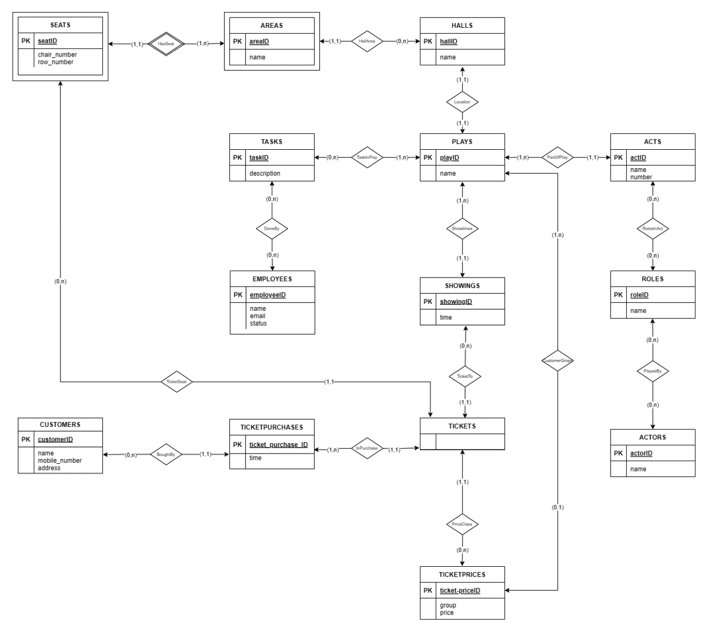

# Database prosjekt

## ER-modell og relasjonsdatabaseskjema

### ER-modell



#### Antakelser og begrunnelse

- En forutsetning vi gjorde var i relasjonen mellom Task og Employee. Vi tenkte at det kan forekomme oppgaver som ikke trenger å knyttes mot et bestemt stykke, men fortsatt være en arbeidsoppgave, for eksempel vedlikehold av scener.
- Vi tenkte også at det ikke ville forekomme stykker som ikke trengte at noen oppgaver måtte gjøres.
- “Time” i “Showings” og “Ticket_purchases” tilsvarer tid og dato, da dette kan nyttes i SQLite.

### Relasjonsdatabaseskjema

Vi markerer primærnøkler med understrek og fremmednøkler i kursiv.

**halls**(<u>hall_id</u>, name)

- Alle tabeller er på 1NF når de har atomiske verdier og en primærnøkkel. Hall_id fungerer som en unik identifier, derfor er denne tabellen på 1NF, 2NF og 3NF. 2NF er oppfylt siden det ikke er noen delvis avhengighet. 3NF er oppfylt siden det ikke er noen transitive avhengigheter. BCNF er også oppfylt siden alle avhengigheter er av funksjonell karakter. Tabellen oppfyller også kravene til 4NF, det er ingen flerverdiavhengigheter.

**areas**(<u>area_id</u>, name, *hall_id*)

- Oppfyller alle normalformene siden area_id er en unik identifier, og det er ingen delvise eller transitive avhengigheter. BCNF er oppfylt fordi alle avhengigheter er av funksjonell karakter. Den tilfredsstiller også 4NF siden det ikke er noen flerverdiavhengigheter.

**seats**(<u>seat_id</u>, chair_number, row_number, *hall_id*, *area_id*)

- Tabellen oppfyller alle normalformene da seat_id er en unik identifier, og det er ingen delvise eller transitive avhengigheter. BCNF er oppfylt siden alle avhengigheter er av funksjonell karakter. Og det er ingen flerverdiavhengigheter, dermed er 4NF også oppfylt.

**plays**(<u>play_id</u>, name, *hall_id*)

- Tabellen oppfyller alle normalformene da play_id er en unik identifier, og det er ingen delvise eller transitive avhengigheter. BCNF oppfylt siden alle avhengigheter er av funksjonelle. Og det er ingen flerverdiavhengigheter, dermed er 4NF også oppfylt.

**showings**(<u>showing_id</u>, time, *play_id*)

- Alle normalformene er oppfylt fordi showing_id er en unik identifier, og det er ingen delvise eller transitive avhengigheter. BCNF oppfylt fordi alle avhengigheter er av funksjonell karakter. 4NF er også oppfylt siden det ikke er flerverdiavhengigheter.

**customers**(<u>customer_id</u>, name, mobile_number, address)

- Tabellen oppfyller normalformene fordi customer_id er unik og det er ingen delvise eller transitive avhengigheter. BCNF er oppfylt siden alle avhengigheter er av funksjonell karakter. Det er ingen flerverdiavhengigheter, derfor oppfyller tabellen 4NF.

**ticket_purchases**(<u>ticket_purchase_id</u>, time, *customer_id*)

- Tabellen oppfyller alle normalformene: Ingen delvise eller transitive avhengigheter, alle avhengigheter er funksjonelle, og det er ingen flerverdiavhengigheter.

**ticket_prices**(<u>ticket_price_id</u>, group, price, *play_id*)

- Denne tabellen oppfyller alle normalformene. Det er ingen delvise eller transitive avhengigheter, alle avhengigheter er funksjonelle og det er ingen flerverdisavhengigheter.

**tickets**(<u>*showing_id*</u>, <u>*seat_id*</u>, <u>*ticket_purchase_id*</u>, *ticket_price_id*)

- Tabellen oppfyller alle normalformene. Ticket_id gir en unik identifier, ingen delvise- eller transitive avhengigheter. Alle avhengigheter er av funksjonell karakter, derfor er BCNF også oppfylt. Det er ingen flerverdiavhengigheter, derfor oppfyller tabellen 4NF.

**acts**(<u>act_id</u>, number, name, *play_id*)

- Oppfyller alle normalformene av samme grunner som tidligere nevnt - unik identifier, ingen delvise- eller transitive avhengigheter, alle avhengigheter er funksjonelle og ingen flerverdiavhengigheter.

**roles**(<u>role_id</u>, name)

- Oppfyller alle normalformene av samme grunner som tidligere nevnt - unik identifier, ingen delvise- eller transitive avhengigheter, alle avhengigheter er funksjonelle og ingen flerverdiavhengigheter.

**roles_in_act**(<u>*act_id*</u>, <u>*role_id*</u>)

- Oppfyller alle normalformene av samme grunner som tidligere nevnt - unik identifier, ingen delvise- eller transitive avhengigheter, alle avhengigheter er funksjonelle og ingen flerverdiavhengigheter.

**actors**(<u>actor_id</u>, name)

- Oppfyller alle normalformene av samme grunner som tidligere nevnt - unik identifier, ingen delvise- eller transitive avhengigheter, alle avhengigheter er funksjonelle og ingen flerverdiavhengigheter.

**played_by**(<u>*role_id*</u>, <u>*actor_id*</u>)

- Oppfyller alle normalformene av samme grunner som tidligere nevnt - unik identifier, ingen delvise- eller transitive avhengigheter, alle avhengigheter er funksjonelle og ingen flerverdiavhengigheter.

**employees**(<u>employee_id</u>, name, email, status)

- Oppfyller alle normalformene av samme grunner som tidligere nevnt - unik identifier, ingen delvise- eller transitive avhengigheter, alle avhengigheter er funksjonelle og ingen flerverdiavhengigheter.

**tasks**(<u>task_id</u>, description, play_id, *employee_id*)

- Oppfyller alle normalformene av samme grunner som tidligere nevnt - unik identifier, ingen delvise- eller transitive avhengigheter, alle avhengigheter er funksjonelle og ingen flerverdiavhengigheter.

## Realisert databasesytem

### Innlevering

1. Zip-fil med Python-kildekode og SQL-schema er levert på BlackBoard.

2. schema.sql-filen lager alle tabellene, og den blir brukt av seed.py så dere trenger ikke kjøre den selv. Vi har ikke en egen insert-db.sql-fil, fordi INSERT-operasjonene blir gjort i seed.py, siden der kan vi lagre ID-ene som variabler mellom de ulike INSERT-operasjonene.

3. “files needed” mappen (som vi fikk delt i oppgaven, den som inkluderer “hovedscenen.txt” og “gamle-scene.txt”) og schema.sql må være plassert sammen med seed.py sånn at den scriptet finner filene. Vi har ikke en tom database fil fordi database filen blir lagd i seed.py.

### Fremgangsmåte

1. Pass på at filene er strukturert slik:
   - files needed
       - gamle-scene.txt
       - hovedscenen.txt
   - schema.sql
   - seed.py
   - buy_tickets_get_price_same_row.py
   - find_showings.py
   - find_actor_and_plays.py
   - find_actor_and_coactors.py
   - bestseller.py

2. Deretter sjekk at du har python installert. Vi har brukt python-versjon 3.10.

3. Kjør `python seed.py` (kan hende du må bytte python med python3 i denne kommandoen) Du skal nå få en trondelag_theatre.db fil med data.

4. Kjør så hvert av scriptene på formen `python script.py`og sjekk database filen at du er fornøyd med resultatet.

### Resultat av brukerhistoriene

1. **Implementasjon av databasen:**

    `python3 seed.py` returnerer:

    ```
    Database created successfully at trondelag_theatre.db
    Added Halls, Plays, Showings, Ticket Prices, Customers and Ticket Purchases to the database
    Added seats and the ones already occupied for the Hovedscenen hall from the file hovedscenen.txt
    Added seats and the ones already occupied for the Gamle scene hall from the file gamle-scene.txt
    Added acts, roles, actors and their relations to the database
    Added employees and tasks to the database
    ```

`
2. **Innsetting av stoler:**

    Se punkt 1. Stolene blir fylt inn i `seed.py` scriptet etter at vi har fylt inn alt av data som oppgaven spør om.

3. **Kjøp av 9 voksenbilletter:**

    `python buy_tickets_get_price_same_row.py` returnerer:

    ```
    You purchased 9 tickets for Størst av alt er kjærligheten in the Gamle scene for row number 1 with seat numbers [1, 2, 3, 4, 5, 8, 9, 10, 11] in Galleri area for: 3150.0 kr
    You purchased 9 tickets for Størst av alt er kjærligheten in the Gamle scene for row number 1 with seat numbers [12, 13, 14, 15, 16, 17, 18, 19, 20] in Galleri area for: 3150.0 kr
    ```

4. **Forestillinger som finnes på en dato og antall solgte billetter:**

    `python find_showings.py` returnerer:

    ```
    Showings on 2024-02-02:
    - Kongsemnene (2024-02-02 19:00:00): 0 tickets sold.
    Showings on 2024-02-03:
    - Størst av alt er kjærligheten (2024-02-03 18:30:00): 36 tickets sold.
    - Kongsemnene (2024-02-03 19:00:00): 65 tickets sold.
    No showings on 2024-02-04.
    ```

5. **Skuespillere som opptrer i de forskjellige teaterstykkene:**

    `python find_actor_and_plays.py` returnerer:

    ```
    Tom Hanks does not appear in any plays.
    Jo Saberniak appears in the following plays and roles:
    - Play: Størst av alt er kjærligheten, Role: Jo Saberniak
    Emma Caroline Deichmann appears in the foll`w`ing plays and roles:
    - Play: Kongsemnene, Role: Sigrid
    - Play: Kongsemnene, Role: Ingebjørg
    ```

6. **Forestillingene som har solgt best:**

    `python sort_by_selling.py` returnerer:

    ```
    - Kongsemnene - Date: 2024-02-03 19:00:00 - Tickets sold: 65
    - Størst av alt er kjærligheten - Date: 2024-02-03 18:30:00 - Tickets sold: 36
    ```

7. **Gitt et skuespillernavn, andre skuespillere de har spilt i samme akt med:**

    `python find_actor_and_coactors.py` returnerer:

    ```
    No co-actors found for Tom Hanks
    Actors who have played with Arturo Scotti in the same act:
    - Arturo Scotti and Emil Olafsson in "Kongsemnene"
    - Arturo Scotti and Emma Caroline Deichmann in "Kongsemnene"
    - Arturo Scotti and Hans Petter Nilsen in "Kongsemnene"
    - Arturo Scotti and Ingunn Beate Strige Øyen in "Kongsemnene"
    - Arturo Scotti and Isak Holkem Sørensen in "Kongsemnene"
    - Arturo Scotti and Madeleine Brantzæg Nilsen in "Kongsemnene"
    - Arturo Scotti and Per Bogstad Gulliksen in "Kongsemnene"
    - Arturo Scotti and Snorre Ryen Tøndel in "Kongsemnene"
    - Arturo Scotti and Synnøve Fossum Eriksen in "Kongsemnene"
    - Arturo Scotti and Thomas Jensen Takyi in "Kongsemnene"
    Actors who have played with Snorre Ryen Tøndel in the same act:
    - Snorre Ryen Tøndel and Arturo Scotti in "Kongsemnene"
    - Snorre Ryen Tøndel and Emil Olafsson in "Kongsemnene"
    - Snorre Ryen Tøndel and Emma Caroline Deichmann in "Kongsemnene"
    - Snorre Ryen Tøndel and Hans Petter Nilsen in "Kongsemnene"
    - Snorre Ryen Tøndel and Ingunn Beate Strige Øyen in "Kongsemnene"
    - Snorre Ryen Tøndel and Isak Holkem Sørensen in "Kongsemnene"
    - Snorre Ryen Tøndel and Madeleine Brantzæg Nilsen in "Kongsemnene"
    - Snorre Ryen Tøndel and Per Bogstad Gulliksen in "Kongsemnene"
    - Snorre Ryen Tøndel and Synnøve Fossum Eriksen in "Kongsemnene"
    - Snorre Ryen Tøndel and Thomas Jensen Takyi in "Kongsemnene"
    ```
